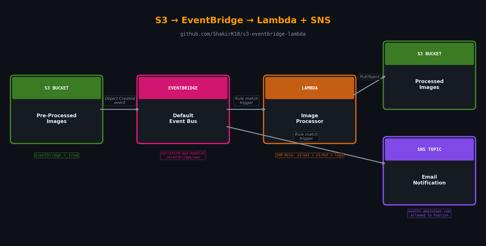

# S3 Image Processing Pipeline with EventBridge

Serverless image processing pipeline using S3, EventBridge, Lambda, and SNS — automated with Terraform.

## Why This Matters

When images are uploaded to a storage bucket, you often need to process them automatically — resize, compress, convert, tag with metadata — before they're ready for consumption. Doing this manually doesn't scale, and polling for new files is wasteful and slow.

This pipeline reacts to uploads in real-time. The moment an image lands in the pre-processed bucket, EventBridge picks up the event and fans it out — Lambda processes the image and drops it in the processed bucket, while SNS fires off an email notification. No polling, no cron jobs, no wasted compute.

## Architecture



1. **S3** receives an image upload to the pre-processed bucket
2. **EventBridge** (default bus) matches the `Object Created` event via a rule
3. **Lambda** is triggered, processes the image, and puts it in the processed bucket
4. **SNS** sends an email notification in parallel

## Prerequisites

- AWS Account with appropriate permissions
- Terraform >= 1.0
- AWS CLI configured

## Project Structure

```
.
├── main.tf          # S3 buckets, EventBridge module, Lambda function
├── permissions.tf   # IAM roles, policies, Lambda + SNS permissions
├── sns.tf           # SNS topic, topic policy, email subscription
├── variables.tf     # Input variables
├── src/
│   └── handler.py   # Lambda function code
└── README.md
```

## Deployment

1. Clone the repository

```bash
git clone https://github.com/ShakirK18/s3-eventbridge-lambda.git
cd s3-eventbridge-lambda
```

2. Initialize Terraform

```bash
terraform init
```

3. Review the plan

```bash
terraform plan
```

4. Apply the configuration

```bash
terraform apply
```

5. **Confirm the SNS email subscription** — check your inbox and click the confirmation link

## Testing

1. Upload an image to the pre-processed bucket:

```bash
aws s3 cp test-image.jpg s3://my-pre-processed-images/test-image.jpg
```

2. Check the processed bucket for the output:

```bash
aws s3 ls s3://my-processed-images/
```

3. Check your email for the SNS notification

## Event Pattern

The EventBridge rule matches any object created in the pre-processed bucket:

```json
{
  "source": ["aws.s3"],
  "detail-type": ["Object Created"],
  "detail": {
    "bucket": {
      "name": ["my-pre-processed-images"]
    }
  }
}
```

Both the Lambda function and the SNS topic are targets on the same rule — EventBridge fans out to both in parallel.

## Key Implementation Details

**EventBridge module** — uses `terraform-aws-modules/eventbridge/aws` with `create_bus = false` since S3 events emit to the default event bus, not a custom one.

**SNS topic policy** — EventBridge uses a service principal (`events.amazonaws.com`) to publish, so the topic policy needs an explicit statement allowing this. Without it, deliveries silently fail.

**Lambda permission** — a resource-based policy (`aws_lambda_permission`) is required to let EventBridge invoke the function. The EventBridge module doesn't create this automatically.

## Customisation

**Add image processing logic** — edit `src/handler.py` to add Pillow or other libraries for resize, format conversion, watermarking, etc.

**Filter by file type** — add a `suffix` filter to the EventBridge rule to only match `.jpg`, `.png`, etc.

**Change bucket names** — update the variables in `variables.tf` or pass them at apply time:

```bash
terraform apply -var="pre_processed_bucket_name=my-uploads" -var="processed_bucket_name=my-output"
```

## Troubleshooting

**Lambda not triggering?**

- Verify `eventbridge = true` is set on the S3 bucket notification
- Check the `aws_lambda_permission` resource exists — without it EventBridge can't invoke the function
- Check EventBridge rule metrics: EventBridge → Rules → Monitoring → look for `MatchedEvents`

**SNS email not arriving?**

- Confirm you clicked the subscription confirmation link
- Check the SNS topic policy allows `events.amazonaws.com` to publish
- Verify the EventBridge rule has both targets (Lambda + SNS)

**Lambda import error?**

- Ensure `handler.py` is at the root of the zip — use `source_file` not `source_dir` in `archive_file` if the directory structure is nested

## Cleanup

```bash
terraform destroy
```

## Cost

- **EventBridge**: Free (first 14 million events/month)
- **Lambda**: Free tier includes 1M requests/month
- **S3**: Standard storage pricing (~$0.023/GB)
- **SNS**: Free tier includes 1,000 email notifications/month

**Total estimated cost: < $1/month** for typical usage.

## Next Steps

- Add image transformation logic (Pillow layer for resize/compress/convert)
- Add DLQ on the Lambda for failed processing
- Extend EventBridge rule with content-based filtering (file size, prefix, suffix)
- Add CloudWatch alarms on Lambda errors and duration

## License

MIT